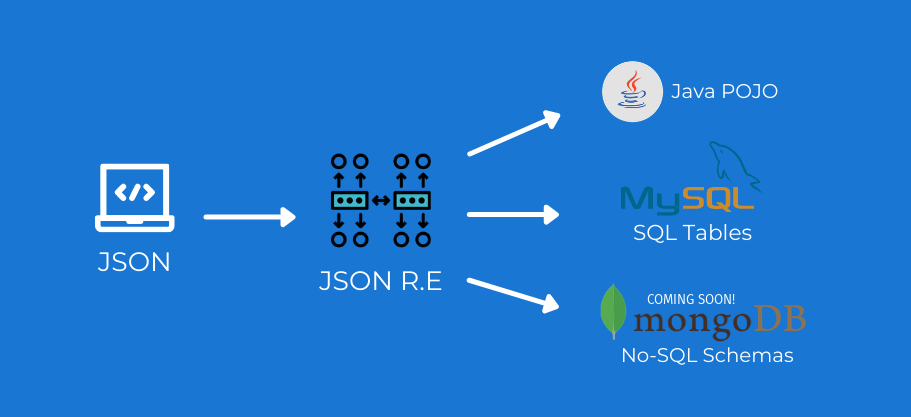

# JSON R.E. Toolkit &lt;json-re&gt;

Generate Java POJOs & SQL tables directly from JSON.



*Coming soon - MongoDb Schema, Mongoose, Joi validation, TypeScript
objects, SQL sequelize.*

# For users

This service is available at [https://ishafayet.github.io/json-re](https://ishafayet.github.io/json-re)

# For developers

### Install the dependencies
```bash
yarn
```

### Start the app in development mode (hot-code reloading, error reporting, etc.)
```bash
yarn run dev
```

### Build the app for production
```bash
yarn run build
```

# Author and License

License: [MIT LICENSE](LICENSE)

2021 © Sayem Shafayet